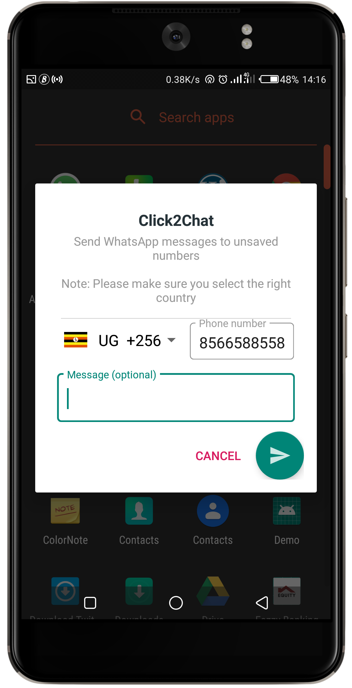

# Click2Chat App - Sending WhatsApp messages to unsaved contacts

WhatsApp has not made it as simple to send WhatsApp messages to unsaved contacts.
The WhatsApp App allows you to only send WhatsApp messages to phone numbers that you've saved in your contacts list.

Click2Chat app allows sending messages to unsaved contacts.

<h3>Demo</h3>
</img>

